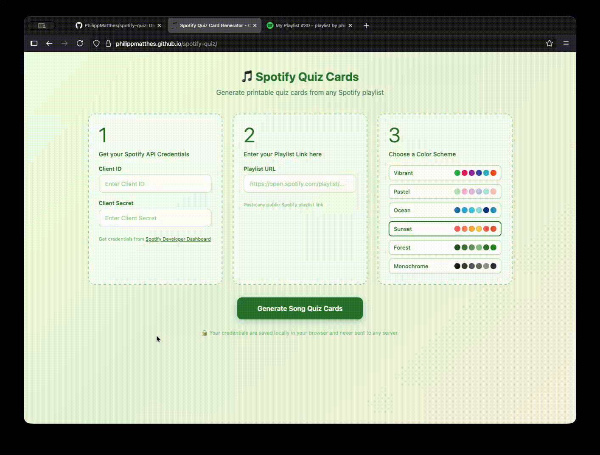

# 🎵 Spotify Quiz Card Generator

Generate quiz cards from any Spotify playlist!

**[Try it live](https://philippmatthes.github.io/spotify-quiz/)**



## How to Use

### 1. Get Spotify API Credentials

1. Go to [Spotify Developer Dashboard](https://developer.spotify.com/dashboard)
2. Log in with your Spotify account
3. Click "Create App"
4. Fill in app name and description (anything works)
5. Copy your **Client ID** and **Client Secret**

### 2. Generate Cards

1. Paste your Client ID and Client Secret
2. Paste a Spotify playlist URL
3. Choose a color scheme
4. Click "Generate Quiz Cards"

### 3. Print

1. Click "Print Cards" or press `Ctrl+P`
2. Enable **duplex printing** (two-sided)
3. Set paper size to **A4**
4. Print!

### 4. Cut

Use the cutting marks at the corners of each card to cut them out. The 2mm bleed ensures no white edges even with slight cutting imprecision.

### 5. Use the QR Scanner

1. Configure your Spotify app to callback to the quiz (just follow the instructions on the page)
2. Open the QR Scanner on your phone
3. Scan the QR code on the back of each card
4. Enjoy the quiz!

## Privacy

- Your Spotify API credentials are stored **only in your browser's localStorage**
- Credentials are **never sent** to any server other than Spotify's official API
- No analytics or tracking
- No cookies (uses localStorage instead)

## Local Development

Simply open `index.html` in a web browser. No server or build process required.

```bash
# Clone the repository
git clone https://github.com/PhilippMatthes/spotify-quiz.git

# Open in browser
open index.html
```

### Using Docker

You can also run the app using Docker with nginx:

```bash
# Build the Docker image
docker build -t spotify-quiz .

# Run the container on port 8000
docker run -p 8000:80 spotify-quiz
```

Then open [http://127.0.0.1:8000](http://127.0.0.1:8000) in your browser.

**Note:** When using the QR Scanner feature with Docker, make sure to add `http://127.0.0.1:8000/index.html` as a Redirect URI in your Spotify Developer Dashboard settings.

## License

MIT License - feel free to use, modify, and distribute.

## Contributing

Pull requests welcome! Feel free to:
- Add new color schemes
- Improve print layout
- Add new features
- Fix bugs
